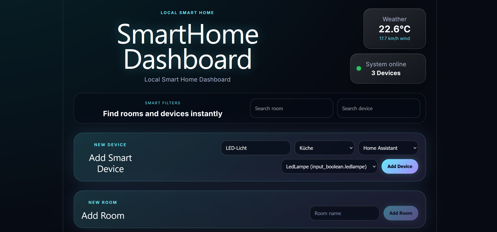

# SmartHome Dashboard

A modern looking local smart home dashboard with device and room management,
Home Assistant integration and live weather data, built with Svelte, .NET and SQLite.

## Features

- Room management
- Device management
- Home Assistant integration
- Live weather based on user location
- Responsive modern UI
- Smart device filtering
- Real-time device states
- Support for Simulation mode for testing and Home Assistant mode for real smart home devices

## Tech Stack

### Frontend
- Svelte 5
- TypeScript
- CSS

### Backend
- ASP.NET Core Web API
- Entity Framework Core
- SQLite

## Screenshots



## Installation

### Frontend

```bash
cd frontend
npm install
npm run dev
```

### Backend

```bash
cd backend
dotnet run
```

## API Features

- Create rooms
- Delete rooms
- Create devices
- Toggle devices
- Delete devices
- Home Assistant entity integration

## Architecture

```txt
Svelte Frontend
       ↓
ASP.NET Core REST API
       ↓
Entity Framework Core
       ↓
SQLite Database
```

## Possible Future Improvements

- Energy monitoring
- Smart automations
- User authentication
- Docker deployment
- Additional smart home integrations
- Mobile optimization improvements


## Author

Jakob Faschang